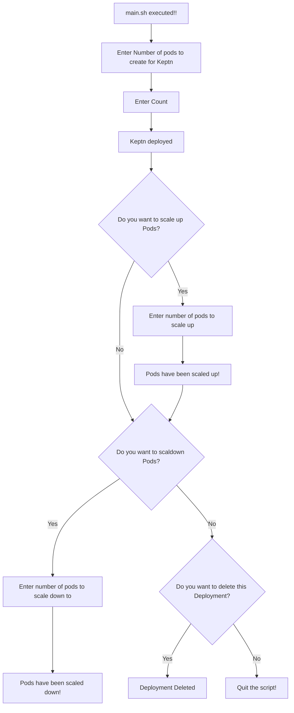

# TechHub2-DeployKeptnUsingKeptn

## Pre-Requisites:
Kubctl with atleast one node should be present. OR Minikube should be installed.

## Workings steps to Deploy Keptn with Replication Controller:

- Deploy keptn rc with (default 3 replicas) following command.
```
kubectl create -f keptn-rc.yaml
```

- Get output of running pods using this command.
```
kubectl get po -o wide
```

- Scale Up / Scale Down the pods using this command.
```
kubectl scale rc keptn-rc --replicas=5
kubectl scale rc keptn-rc --replicas=1
```

- Delete keptn-rc after deployment
```
kubectl delete -f keptn-rc.yaml
```
**Note** Also there is a file main.sh that does all the above steps for you :)

### Executions steps
Just execute the main.sh file using this command. Rest script will handle everything relaxed

```
bash main.sh
```

## Flow of Deployment:
